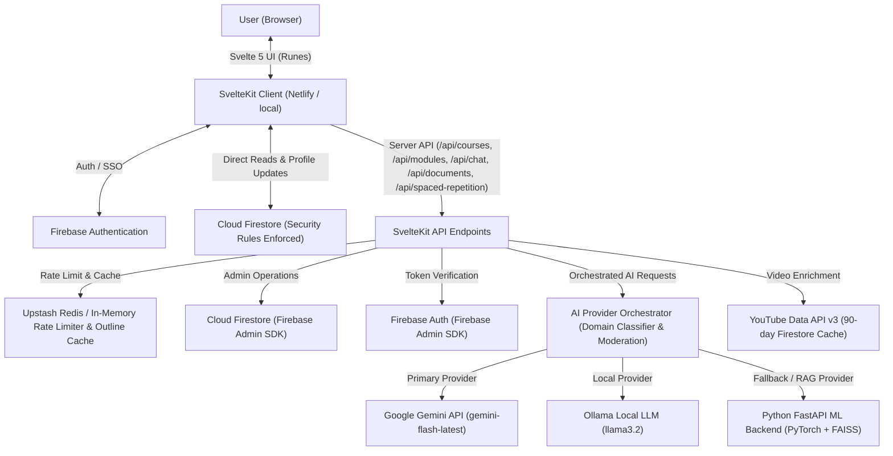

# AI Study Buddy

[](https://svelte.dev/)
[](https://kit.svelte.dev/)
[](https://vitejs.dev/)
[](https://tailwindcss.com/)
[](https://firebase.google.com/)
[](https://www.typescriptlang.org/)
[](https://fastapi.tiangolo.com/)
[](https://ollama.com/)
[](https://upstash.com/)
[](https://vitest.dev/)
[](https://playwright.dev/)
[](https://www.netlify.com/)

**AI Study Buddy** is an intelligent, personalized e-learning platform powered by a multi-provider Generative AI engine, spaced repetition memory schedulers (SM-2 & FSRS), custom document RAG search, interactive study microservices, and gamified daily streak mechanisms. Developed as a Final Year Project for the Department of Computer Science at **Kwame Nkrumah University of Science & Technology (KNUST)**.

---

## 🎓 Academic Project Context

- **Institution:** Kwame Nkrumah University of Science & Technology (KNUST)
- **Department:** Department of Computer Science
- **Course:** Final Year Project (Group 13)
- **Supervisor:** Dr. Rosemary
- **Submitted By:**
  - **Ahado Ronald Ofoe** (Index: `3366322`)
  - **Yoofi Ashon** (Index: `3377222`)

---

## ✨ Key Features

- **Self-Hosted AI Course Generation & Draft Outline Editor:** Instantly generate structured multi-module course outlines from any topic or prompt. Features an interactive draft editor (`DraftOutlineEditor.svelte`) to review, reorder, add, or customize modules before committing course creation.
- **Asynchronous Serverless Workflows:** Instantly renders skeletal course containers and module placeholders while generating lesson content and interactive multiple-choice quizzes on-demand with built-in retry mechanisms and background generation queueing (`generationQueue.ts`).
- **Spaced Repetition Knowledge Hub (`/app/review`, `/api/spaced-repetition`):** Features personalized flashcard review scheduling powered by **SuperMemo 2 (SM-2)** (`sm2.ts`) and **Free Spaced Repetition Scheduler (FSRS)** (`fsrs.ts`) algorithms for optimal long-term memory retention.
- **Custom Document RAG Ingestion (`/app/knowledge`, `/api/documents`):** Upload custom PDF/text reference documents into a vector store to ground AI course outline generation, lesson content, and assistant queries in user-provided study materials.
- **Gamified Daily Streaks & Milestones:** Keeps students motivated with an interactive streak counter computed authoritatively on the server based on client IANA timezone headers (`X-Client-Timezone`). Includes daily goal activity rings (`DailyGoalRing.svelte`), calendar heatmaps (`StreakHeatmap.svelte`), and target badge progression (`BadgeStrip.svelte`).
- **Interactive AI Study Buddy & Microservices:**
  - **Assistant Chat (`AssistantChat.svelte`):** Context-aware in-app chatbot to answer course questions in real time.
  - **Text Summarizer (`/api/summarize`):** Condenses dense lesson material into actionable bullet points and key takeaways.
  - **Text Paraphraser (`/api/paraphrase`):** Rephrases complex sentences into **Academic**, **Simple**, or **Formal** tone options.
  - **Educational Video Finder (`youtube.ts`):** On-demand lookup of relevant YouTube educational videos per module with 90-day Firestore caching and stampede prevention locks.
  - **Lesson Audio Player (`LessonAudioPlayer.svelte`):** Listen to generated lesson text via built-in audio playback.
  - **Interactive Mermaid Visualizer (`MermaidDiagram.svelte`):** Automatically renders interactive visual diagrams and flowcharts within lesson content.
- **Course Sharing & Community Catalog:**
  - **Share Links & Token Generation:** Create secure share links (`ShareModal.svelte`) for public course distribution.
  - **Public Explore Catalog (`/app/explore`):** Browse public courses created by peers.
  - **Course Cloning (`/shared/[shareId]`):** Clone public shared courses directly into your personal user workspace.
  - **Course Completion Certificates (`CertificateModal.svelte`):** Generate and download official certificates upon completing course modules and quizzes.
- **Multi-Provider AI Resiliency Architecture:** High-availability AI layer supporting Google Gemini as the primary provider, local Ollama models (`llama3.2`), and a dedicated Python FastAPI inference pipeline (`ml_backend`) with domain classification, memorization guards, and moderation filters (`moderation.ts`).
- **Superadmin Portal & System Administration (`/superadmin`, `/app/admin`):** Comprehensive admin dashboard for platform metrics, user management, role control, content moderation flag reviews (`ContentFlagModal.svelte`), and classifier calibration.
- **Multi-Provider Authentication & User Settings:**
  - Secure Email/Password registration & Google OAuth SSO via Firebase Authentication.
  - Interactive profile menu with email verification badge, direct access to user settings (`/app/settings`), theme switching, and instant logout.
  - Email verification workflow (`/app/verify-email`) with resend confirmation capabilities.
- **Curated Theme System & Security:**
  - Dynamic style switching between curated color palettes (**Calm**, **Sage**, **Focus Dark**).
  - Client-side XSS sanitization via `isomorphic-dompurify`.
  - Upstash / Redis REST integration (`redis.ts`) for distributed serverless rate limiting and outline caching with smooth fallback to in-memory sliding-window rate limiting (`rateLimiter.ts`) and outline caching (`outlineCache.ts`).

---

## 🛠️ Tech Stack & Dependencies

### Frontend & Serverless Framework

- **Framework:** SvelteKit (`v2.63+`) with Svelte 5 Runes (`$state`, `$derived`, `$props`)
- **Build Tool:** Vite (`v8.0+`)
- **Styling & UI:** Tailwind CSS (`v4.3+`) via `@tailwindcss/vite`, Lucide Svelte icons (`@lucide/svelte`), and Google Fonts (`@fontsource/inter`, `@fontsource/jetbrains-mono`, `@fontsource/poppins`)
- **Database & Auth:** Cloud Firestore & Firebase Auth (`v12.16+`) with server-side session token verification via Firebase Admin SDK (`v14.1+`)
- **Serverless API Layer:** SvelteKit API endpoints (`src/routes/api/`) deployed on Netlify Functions with distributed Upstash Redis / in-memory rate limiting and outline caching

### AI & Machine Learning Microservices

- **Google Gemini API:** Primary generative AI provider (`gemini-flash-latest`)
- **Ollama Local LLM:** Local model provider (`llama3.2`) for offline/tier-2 inference
- **Python FastAPI Microservice (`ml_backend`):** PyTorch, Hugging Face Transformers, Sentence-Transformers, and FAISS for vector embedding & RAG retrieval
- **Spaced Repetition Engines:** Custom TypeScript implementations of SuperMemo 2 (`sm2.ts`) and FSRS (`fsrs.ts`)
- **Content Moderation & Guardrails:** Domain classifier (`domainClassifier.ts`), memorization guard (`memorizationGuard.ts`), and moderation pipeline (`moderation.ts`)

### Distributed Caching & External APIs

- **Upstash Redis REST API:** Distributed caching and rate limiting across serverless instances (`redis.ts`)
- **YouTube Data API v3:** Educational video enrichment with 90-day Firestore caching (`youtube.ts`)

### Testing & Quality Assurance

- **Unit & API Testing:** Vitest (`v4.1+`) with `@firebase/rules-unit-testing`
- **End-to-End Testing:** Playwright (`v1.60+`) for full user journey verification
- **Code Standards:** ESLint (`v10.4+`), Prettier (`v3.8+`), and `svelte-check` (`v4.6+`)

---

## 📂 Project Structure

```
Study/
├── docs/                       # Project documentation & specs
│   ├── API.md                  # Complete REST API endpoint specification
│   ├── CODEBASE_AUDIT.md       # Comprehensive codebase quality review & metrics
│   ├── MULTI_PROVIDER_AND_RAG_ARCHITECTURE.md # Multi-provider decision tree & RAG vector pipeline spec
│   ├── PROJECT_FEATURES.md     # Feature list, roadmap, and architecture notes
│   ├── PROJECT_LIMITATIONS_AND_EVALUATION.md # Academic limitations, evaluation methodology & future work
│   └── production_readiness_audit.md # Production deployment checklist
├── ml_backend/                 # Python FastAPI ML Microservice
│   ├── app/                    # FastAPI routers & inference logic
│   ├── fine_tuning/            # Fine-tuning scripts & datasets
│   ├── models/                 # Model cache & local checkpoints
│   ├── schemas/                # Data models and Pydantic schemas
│   ├── vector_store/           # FAISS vector database store
│   ├── cache.py                # Embedding & inference result caching
│   ├── convert_pdfs.py         # PDF processing script
│   ├── ingest_sciq.py          # SciQ dataset ingestion script
│   ├── main.py                 # FastAPI application entrypoint
│   ├── download_models.py      # Hugging Face model pre-downloader
│   ├── Dockerfile              # Container deployment manifest
│   └── requirements.txt        # Python backend dependencies
├── scripts/                    # Development & administrative utility scripts
│   └── calibrate_domain_classifier.ts # Calibrates domain classifier thresholds
├── src/                        # SvelteKit Application Source
│   ├── lib/
│   │   ├── components/         # Reusable Svelte 5 UI components
│   │   │   ├── AccuracyDisclaimer.svelte # AI content disclaimer banner
│   │   │   ├── AppShell.svelte         # Application layout & navigation container
│   │   │   ├── AssistantChat.svelte    # Interactive AI Study Buddy chat widget
│   │   │   ├── AuthForm.svelte         # Authentication form component
│   │   │   ├── AuthModal.svelte        # Modal wrapper for login/signup
│   │   │   ├── BadgeStrip.svelte       # Gamification achievement badges
│   │   │   ├── CertificateModal.svelte # Course completion certificate viewer
│   │   │   ├── CompletionScreen.svelte # Quiz score summary & review
│   │   │   ├── ContentFlagModal.svelte # AI content flagging & reporting modal
│   │   │   ├── CourseCard.svelte       # Dashboard course card component
│   │   │   ├── DailyGoalRing.svelte    # Daily goal progress indicator
│   │   │   ├── DesktopSidebar.svelte   # Desktop navigation sidebar
│   │   │   ├── DraftOutlineEditor.svelte # Interactive course outline editor
│   │   │   ├── EmptyState.svelte       # Empty state placeholder component
│   │   │   ├── Header.svelte           # Top navigation bar with profile menu
│   │   │   ├── HeroPanel.svelte        # Dashboard hero greeting banner
│   │   │   ├── LessonAudioPlayer.svelte # Text-to-speech audio player component
│   │   │   ├── MermaidDiagram.svelte   # Interactive Mermaid flowchart renderer
│   │   │   ├── MobileNav.svelte        # Mobile responsive navigation bar
│   │   │   ├── PageIndicator.svelte    # Page step indicator component
│   │   │   ├── ProgressBar.svelte      # Visual progress bar component
│   │   │   ├── ShareModal.svelte       # Course share modal & link generator
│   │   │   ├── SharedCourseCard.svelte # Community catalog course card
│   │   │   ├── Skeleton.svelte         # UI loading skeleton placeholder
│   │   │   ├── StreakChip.svelte       # User streak status badge
│   │   │   ├── StreakHeatmap.svelte    # Calendar streak activity heatmap
│   │   │   ├── ThemeSwitcher.svelte    # App theme toggle (Calm, Sage, Focus Dark)
│   │   │   └── Toast.svelte            # Global toast notifications
│   │   ├── firebase/           # Client Firebase init, converters & security rules tests
│   │   │   ├── client.ts       # Client Firebase App & Auth init
│   │   │   ├── converters.ts   # Firestore typed document converters
│   │   │   └── rules.test.ts   # Firestore security rules unit tests
│   │   ├── server/             # Server-only utilities
│   │   │   ├── admin.ts        # Firebase Admin SDK initialization
│   │   │   ├── auth.ts         # Server-side auth & session token verification
│   │   │   ├── fsrs.ts         # Free Spaced Repetition Scheduler algorithm
│   │   │   ├── outlineCache.ts # Course outline caching layer
│   │   │   ├── rateLimiter.ts  # In-memory sliding-window rate limiter
│   │   │   ├── redis.ts        # Upstash Redis REST client for distributed caching
│   │   │   ├── sm2.ts          # SuperMemo 2 spaced repetition algorithm
│   │   │   ├── youtube.ts      # YouTube Data API video fetcher & cacher
│   │   │   ├── ai/             # Multi-provider AI abstraction layer
│   │   │   │   ├── client.ts   # AI client initialization
│   │   │   │   ├── domainClassifier.ts # Subject domain classifier
│   │   │   │   ├── gemini.ts   # Google Gemini provider integration
│   │   │   │   ├── generationQueue.ts # Module generation queuing system
│   │   │   │   ├── memorizationGuard.ts # Grounding & anti-hallucination guard
│   │   │   │   ├── moderation.ts # AI output content moderation
│   │   │   │   ├── ollama.ts   # Ollama local LLM provider integration
│   │   │   │   ├── provider.ts # Unified AI provider orchestrator
│   │   │   │   └── providerStats.ts # Provider metrics & health tracker
│   │   │   └── superadmin/     # Superadmin management backend service
│   │   │       └── user.ts     # User management & platform admin utilities
│   │   └── stores/             # Svelte stores for app, auth, & theme state
│   └── routes/                 # SvelteKit page routes & API endpoints
│       ├── +layout.svelte      # Root layout & global style setup
│       ├── +page.svelte        # Landing page & Authentication (Login / Sign-Up)
│       ├── api/                # REST API endpoints
│       │   ├── admin/          # Admin management API
│       │   ├── chat/           # AI Study Assistant chat endpoint
│       │   ├── courses/        # Course creation, listing, retrieval, & sharing API
│       │   ├── documents/      # RAG custom document upload & indexing API
│       │   ├── flag/           # Content moderation flagging API
│       │   ├── health/         # System health check API
│       │   ├── modules/        # On-demand module content & quiz generation API
│       │   ├── paraphrase/     # Text paraphrasing microservice API
│       │   ├── share/          # Shared course token resolution API
│       │   ├── spaced-repetition/ # Spaced repetition review & queue API
│       │   ├── summarize/      # Text summarization microservice API
│       │   ├── superadmin/     # Superadmin stats & user management API
│       │   └── user/           # User profile management API
│       ├── app/                # Authenticated application view
│       │   ├── +layout.svelte  # AppShell wrapper with sidebar & header profile menu
│       │   ├── +page.svelte    # User Dashboard (Resume course, streaks, badges)
│       │   ├── admin/          # Platform administration dashboard
│       │   ├── courses/        # Course player, draft editor, lesson view, & module quizzes
│       │   ├── explore/        # Public course discovery catalog & clone trigger
│       │   ├── knowledge/      # Custom document RAG knowledge base
│       │   ├── review/         # Spaced repetition flashcard review queue
│       │   ├── settings/       # User account settings & theme options
│       │   └── verify-email/   # Email verification alert & resend screen
│       ├── share/              # Public share link resolver route ([token])
│       ├── shared/             # Shared course preview & clone handler ([shareId])
│       └── superadmin/         # Platform superadmin control portal
├── tests/                      # End-to-End Playwright test suite
│   └── userJourney.e2e.ts      # Comprehensive E2E user flow test script
├── firebase.json               # Firebase CLI & emulator configuration
├── firestore.rules             # Declarative Cloud Firestore security rules
├── firestore.indexes.json      # Firestore composite indexes definition
├── package.json                # Frontend dependencies & npm scripts
├── playwright.config.ts        # Playwright E2E configuration
├── svelte.config.js            # SvelteKit setup & preprocessor config
├── tsconfig.json               # TypeScript compiler configuration
└── vite.config.ts              # Vite bundler, Tailwind CSS v4 & Vitest setup
```

---

## 📐 System Architecture

The application employs a serverless architecture designed for fast initial response times, resilient multi-provider AI execution, spaced repetition memory review, document RAG grounding, and secure data access.



---

## 🚀 Local Development Setup

Follow these instructions to run the full application locally.

### Prerequisites

- **Node.js:** v18.0.0 or higher
- **npm:** v9.0.0 or higher
- **Python:** 3.10+ (for `ml_backend`)
- **Ollama (Optional):** Installed and running locally if using local LLM inference

### 1. Clone & Install Dependencies

```bash
# Install SvelteKit frontend dependencies
npm install

# Install Python ML backend dependencies
cd ml_backend
pip install -r requirements.txt
cd ..
```

### 2. Configure Environment Variables

Create a `.env` file in the root directory (copy from `.env.example`):

```bash
cp .env.example .env
```

Required `.env` variables:

```env
# Firebase Client Configuration
PUBLIC_FIREBASE_API_KEY=demo-api-key
PUBLIC_FIREBASE_AUTH_DOMAIN=ai-study-buddy-knust.firebaseapp.com
PUBLIC_FIREBASE_PROJECT_ID=ai-study-buddy-knust
FIREBASE_PROJECT_ID=ai-study-buddy-knust
PUBLIC_FIREBASE_STORAGE_BUCKET=ai-study-buddy-knust.appspot.com
PUBLIC_FIREBASE_MESSAGING_SENDER_ID=1234567890
PUBLIC_FIREBASE_APP_ID=1:1234567890:web:1234567890

# Optional: Set true when using local Firebase emulators
PUBLIC_FIREBASE_USE_EMULATOR=false

# Primary AI Provider Key (Google Gemini API)
GEMINI_API_KEY=your-gemini-api-key
GEMINI_MODEL=gemini-flash-latest

# Local Ollama LLM Settings (Tier 2 Fallback)
OLLAMA_BASE_URL=http://localhost:11434
OLLAMA_MODEL=llama3.2

# Fallback Python ML Backend Endpoint & Key
ML_BACKEND_URL=http://localhost:8000
ML_BACKEND_API_KEY=your-ml-backend-key

# Distributed Upstash Redis Configuration (Optional)
UPSTASH_REDIS_REST_URL=
UPSTASH_REDIS_REST_TOKEN=

# YouTube Data API v3 Key (Supplementary Video Fetching)
YOUTUBE_API_KEY=
```

### 3. Start Python ML Backend

In a dedicated terminal, launch the Uvicorn FastAPI server:

```bash
cd ml_backend
uvicorn main:app --reload --port 8000
```

### 4. Start Firebase Emulators (Optional for local Auth/Firestore testing)

In another terminal, start local Firestore and Auth emulators:

```bash
npx firebase emulators:start
```

### 5. Start SvelteKit Dev Server

In your primary terminal, launch the Vite development server:

```bash
npm run dev
```

Open your browser and visit `http://localhost:5173`.

---

## 🔒 Firestore Security Rules

Database access is secured using declarative Firestore security rules (`firestore.rules`):

- **/users/{uid}**: Authenticated users can read their own profile. Direct client updates are restricted strictly to the `theme` field to prevent client-side modification of streak metrics or course stats.
- **/courses/{courseId}**: Users can only read courses where `userId == request.auth.uid`. Direct document creation and deletion via client SDK are blocked (handled exclusively by server-side Firebase Admin SDK).
- **/sharedCourses/{token}**: Read access is permitted for authenticated users presenting a valid share token; write operations are restricted to server-side Admin SDK.

---

## 📖 API Documentation

Detailed REST API specifications for all routes (`/api/courses`, `/api/modules`, `/api/chat`, `/api/summarize`, `/api/paraphrase`, `/api/share`, `/api/documents`, `/api/spaced-repetition`, `/api/flag`) are available in [docs/API.md](docs/API.md).

---

## 🧪 Testing & Code Quality Commands

The repository includes comprehensive automated test suites and validation utilities:

- **Type Checking:**
  ```bash
  npm run check
  ```
- **Code Linting & Formatting:**
  ```bash
  npm run lint     # Check formatting & run ESLint
  npm run format   # Auto-format codebase with Prettier
  ```
- **Unit & Integration Tests (Vitest):**
  ```bash
  npm run test:unit
  ```
- **End-to-End Tests (Playwright):**
  ```bash
  npm run test:e2e
  ```
- **Run Full Automated Verification Suite:**
  ```bash
  npm run test
  ```
- **Calibrate AI Domain Classifier:**
  ```bash
  npx tsx scripts/calibrate_domain_classifier.ts
  ```
