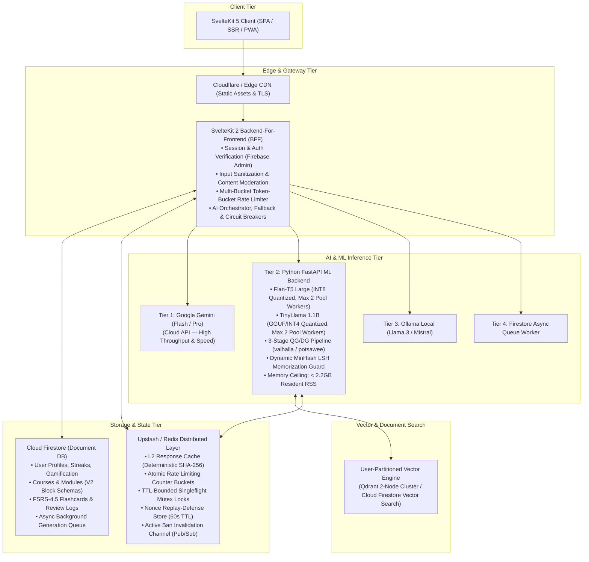
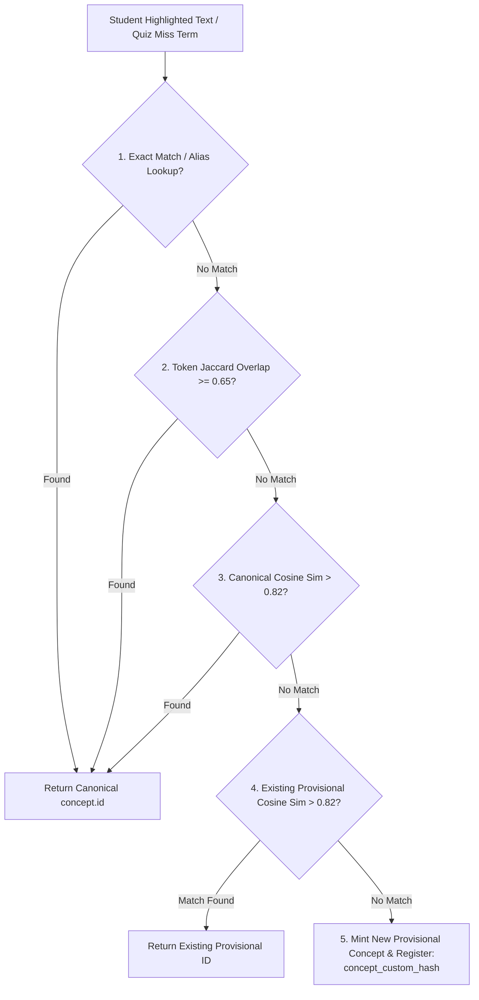
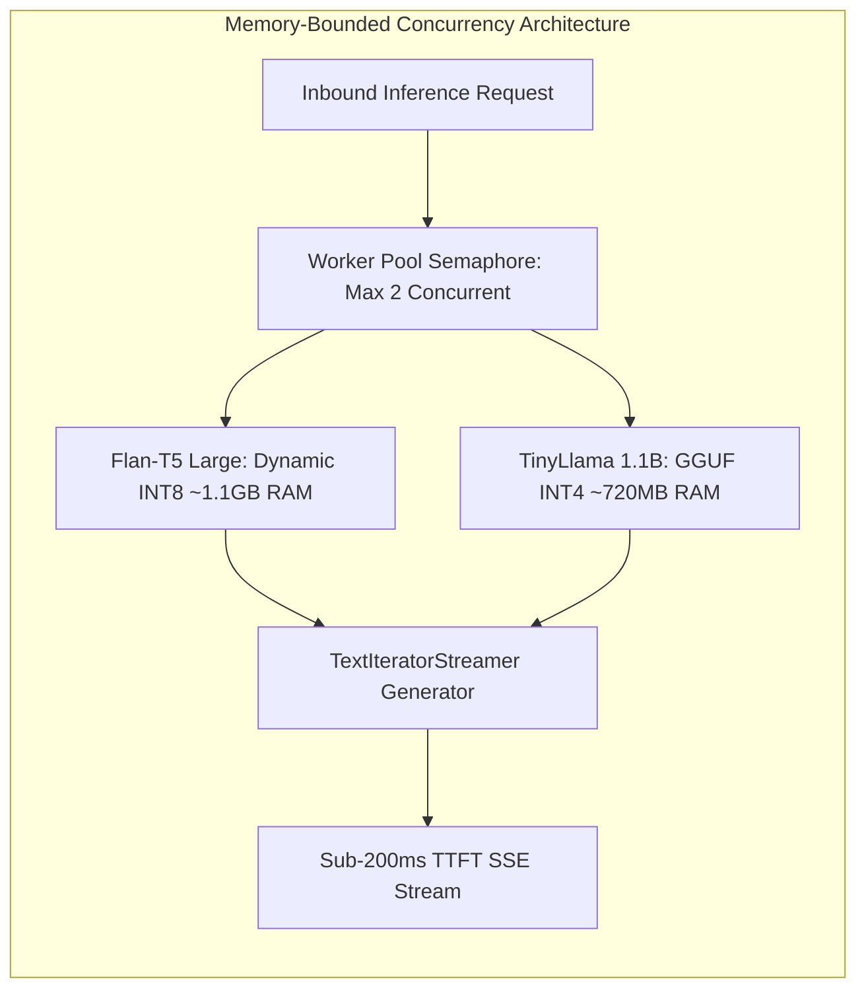
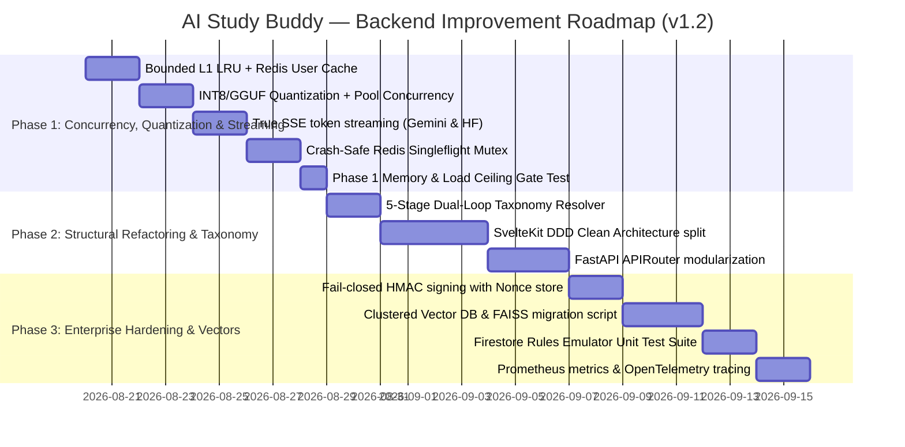

# AI Study Buddy — Backend & Infrastructure Improvement Strategy

**Document Version:** 1.2.0  
**Date:** August 2026  
**Target Platform:** AI Study Buddy (SvelteKit 2, Svelte 5, Cloud Firestore, Upstash Redis, Google Gemini, Ollama, Python FastAPI ML Backend, User-Partitioned Vector Store)  
**Authors:** Platform Engineering & Software Architecture Team

---

## 1. Executive Summary

This document outlines a comprehensive, production-grade architectural and engineering improvement strategy for the **AI Study Buddy** backend ecosystem. It reviews the entire backend stack—including the SvelteKit 2 Backend-For-Frontend (BFF), Firebase Authentication, Cloud Firestore data layers, Upstash/Redis caching and rate limiting, the self-hosted Python FastAPI ML inference server, vector retrieval-augmented generation (RAG) pipelines, and multi-provider AI routing.

The goal is to transition the backend from a monolithic prototype into a decoupled, high-throughput, highly resilient, and cost-effective distributed architecture with sub-200ms initial response latency, robust security boundaries, and horizontal scalability.



---

## 2. Current Architecture & Bottleneck Audit

An exhaustive code inspection of the existing backend services identified the following critical areas requiring refactoring:

| Component | Current State | Root Cause & Bottleneck | Target Architecture |
|---|---|---|---|
| **Session Verification** (`auth.ts`) | Reads Firestore on every request | `verifySessionUser()` calls `adminDb.collection('users').doc(uid).get()` for every single authenticated API request to confirm profile existence. | **Bounded L1 LRU (5k Max) + L2 Redis + Active Ban Invalidation**: LRU cache with explicit size cap & 15m TTL, backed by Redis and instant Pub/Sub ban invalidation. |
| **Chat Streaming & Lock Contention** (`chat_assistant.py`) | Space-split SSE + Global `inference_lock` | Single lock forces all users into a sequential queue; streaming splits finished text with `setTimeout(15ms)`. | **Phase 1 Combined Concurrency & Quantization**: Quantize Flan-T5 & TinyLlama to INT8/GGUF alongside lock removal with a 2-worker pool ceiling (<2.2GB RSS). |
| **Concept Taxonomy Resolution** (`taxonomy.ts`) | Unspecified slug matching & terminal hash fallback | Highlight text misses match canonical list and mint distinct hashes, reopening card duplicate drift. | **5-Stage Dual-Loop Concept Resolver**: Exact $\to$ Token Jaccard $\to$ Canonical Cosine $\to$ **Existing Provisional Cosine** $\to$ Mint new provisional with merge hook. |
| **Vector Store & RAG** (`rag_pipeline.py`) | Single flat FAISS index in memory + JSON disk file | Single `IndexFlatL2` stores all users' vectors together; search fetches $5 \times k$ items and filters by `user_id` via a Python loop in memory. | **User-Partitioned Clustered Vector Store**: Qdrant 2-node cluster / Firestore Vector Search with native payload filtering and legacy FAISS migration script. |
| **Cross-Service Security** | Static API Key (`X-API-Key`) | Inter-service authentication relies on a single shared static string, vulnerable to replay and lack of request tampering validation. | **Strict Fail-Closed HMAC-SHA256 with Nonces**: Time-bound signatures with UUID nonces verified against Redis (60s TTL); fails closed on missing secret. |
| **Singleflight Concurrency** (`outlineCache.ts`) | In-memory only, no crash recovery | If worker crashes during inference, identical concurrent requests can hang indefinitely. | **Redis TTL-Bounded Singleflight Mutex**: `SET lock:key <id> NX PX 45000` with 40s polling timeout and automatic execution fallback. |
| **Firestore Security Rules** (`firestore.rules`) | Unaudited write constraints | Potential for client write bypasses to server-authoritative collections. | **Emulator Automated Rule Unit Testing**: Assert zero unauthorized client writes across `/courses`, `/modules`, `/usage`, `/progress`, `/weakTopics`. |

---

## 3. Clean Backend Architecture & Structural Reorganization

### 3.1 SvelteKit BFF Domain Layering with Facade Preservation

```
src/lib/server/
├── domain/                      # Pure business models & logic (No external SDK dependencies)
│   ├── course/
│   │   ├── courseEntity.ts      # Course, Module, ContentBlock interfaces
│   │   └── taxonomy.ts          # 5-Stage Dual-Loop CanonicalConcept Resolver
│   ├── fsrs/
│   │   └── fsrsEngine.ts        # Authoritative FSRS-4.5 pure math (Retrievability, Stability)
│   └── rateLimit/
│       └── tokenBucket.ts       # Sliding window rate limit algorithms
├── application/                 # Use Cases & Application Services (Orchestrates domain & infrastructure)
│   ├── courseService.ts         # Course creation, outline generation, batch module build
│   ├── chatService.ts           # Socratic tutor instructions, session event context merging, streaming
│   ├── flashcardService.ts      # Review scheduling, deduplication, backfill migration
│   └── moderationService.ts     # Content safety checks & topic filtering
├── infrastructure/              # External Adapters, SDKs & Concrete Repositories
│   ├── repositories/
│   │   ├── firestoreCourseRepo.ts
│   │   ├── firestoreUserRepo.ts
│   │   └── firestoreFlashcardRepo.ts
│   ├── ai/
│   │   ├── geminiClient.ts
│   │   ├── mlBackendClient.ts
│   │   ├── ollamaClient.ts
│   │   └── circuitBreaker.ts
│   └── cache/
│       ├── redisService.ts
│       └── memoryCache.ts
├── ai/                          # Public Facade (Preserves 100% frontend compatibility)
│   ├── provider.ts              # Exports generateOutline, generateLessonV2, chat, AIProvenanceMetadata
│   ├── client.ts                # HTTP client with HMAC signing & Nonce generation
│   └── gemini.ts / ollama.ts    # Low-level provider engines
├── fsrs.ts                      # Public Facade (Exports calculateFSRS delegating to domain/fsrsEngine.ts)
└── interfaces/                  # Thin HTTP controllers (Route Handlers)
    └── api/                     # Validate inputs (Zod) -> Call Application Service -> Return JSON/SSE
```

### 3.2 Canonical Concept Taxonomy & Dual-Loop Resolution Algorithm

To permanently close the deduplication gap for both canonical concepts and user-generated provisional highlights, `src/lib/server/domain/course/taxonomy.ts` implements a 5-stage dual-loop resolution pipeline:



#### Detailed 5-Stage Specification:
1. **Stage 1 — Exact Normalization & Alias Match**: Match normalized text against canonical module `concepts.term` or `concepts.aliases`.
2. **Stage 2 — Token Jaccard Similarity**: If $J(A, B) = \frac{|A \cap B|}{|A \cup B|} \ge 0.65$ against any canonical concept, resolve to `concept.id`.
3. **Stage 3 — Canonical Semantic Cosine Similarity**: Compute embedding cosine similarity against canonical module concepts with `all-MiniLM-L6-v2`. If $\text{sim} > 0.82$, resolve to `concept.id`.
4. **Stage 4 — Existing Provisional Concepts Loop (Anti-Duplication Gate)**:
   - Fetch previously created provisional concepts for this module from the module's `provisionalConcepts` registry.
   - Compute cosine similarity against all existing provisional concepts.
   - If $\text{sim} > 0.82$, **reuse the existing provisional ID** rather than minting a duplicate.
5. **Stage 5 — Mint New Provisional Concept**:
   - If all 4 checks fail, mint `concept_custom_${sha256(text).slice(0, 10)}` and append it to the module's `provisionalConcepts` list for future matches.

---

## 4. Database & Storage Optimization (Cloud Firestore & Vectors)

### 4.1 Bounded L1 LRU + Redis User Existence Caching with Active Invalidation

To guarantee memory safety, eventual consistency, and instant revocation upon user bans:
1. **Explicit LRU Eviction**: When `L1_USER_CACHE.size >= 5000`, explicitly evict `L1_USER_CACHE.keys().next().value`.
2. **Active Invalidation Channel**: When an admin bans or deletes a user, the backend executes:
   - `redis.del('user:exists:' + uid)`
   - `redis.publish('auth:user_revoked', uid)`
   - All server instances subscribe to `auth:user_revoked` and instantly execute `L1_USER_CACHE.delete(uid)`, guaranteeing **zero-latency immediate ban enforcement**.

```typescript
// src/lib/server/auth.ts
import { adminAuth, adminDb, FieldValue } from './admin';
import { redisGet, redisSet, isRedisConfigured } from './redis';

interface CacheEntry {
    exists: boolean;
    expiresAt: number;
}

const L1_USER_CACHE = new Map<string, CacheEntry>();
const L1_TTL_MS = 15 * 60 * 1000; // 15 minutes bounded TTL
const MAX_L1_ENTRIES = 5000;

function getL1(uid: string): boolean | null {
    const entry = L1_USER_CACHE.get(uid);
    if (!entry) return null;
    if (Date.now() > entry.expiresAt) {
        L1_USER_CACHE.delete(uid);
        return null;
    }
    // Re-insert key to refresh LRU access order
    L1_USER_CACHE.delete(uid);
    L1_USER_CACHE.set(uid, entry);
    return entry.exists;
}

function setL1(uid: string, exists: boolean): void {
    if (L1_USER_CACHE.has(uid)) {
        L1_USER_CACHE.delete(uid);
    } else if (L1_USER_CACHE.size >= MAX_L1_ENTRIES) {
        // Explicit oldest LRU key eviction
        const oldestKey = L1_USER_CACHE.keys().next().value;
        if (oldestKey) L1_USER_CACHE.delete(oldestKey);
    }
    L1_USER_CACHE.set(uid, { exists, expiresAt: Date.now() + L1_TTL_MS });
}

export function invalidateUserSessionCache(uid: string): void {
    L1_USER_CACHE.delete(uid);
}
```

### 4.2 Vector Store Topology & Data Migration

#### Production Topology Decision:
- Deploy a **2-Node Replicated Qdrant Cluster** on private VPC networking (or use **Cloud Firestore Vector Search**).
- Replicas guarantee high availability, sub-5ms vector queries, and zero single-point failure.
- Migration script `scripts/migrate_faiss_to_vector_store.py` reads existing `docs.json` + `index.faiss` and inserts points with typed metadata (`user_id`, `course_id`, `chunk_text`).

---

## 5. Machine Learning Backend & Inference Optimization

### 5.1 Combined Concurrency & Quantization Architecture (OOM Prevention)

To prevent container out-of-memory (OOM) crashes during concurrent execution, **model quantization is coupled directly with lock removal in Phase 1**:



- **Strict Resident Memory Budget**:
  $$\text{Quantized Flan-T5 (1.1GB)} + \text{Quantized TinyLlama (720MB)} + \text{Base Overhead (300MB)} = \mathbf{2.12\text{ GB RSS}}$$
- **Pool Concurrency Limit**: Capped at **2 concurrent workers per model** via an asyncio Semaphore to strictly guarantee the container never exceeds a 2.5GB RAM ceiling.

---

## 6. Security, Hardening & Resilience

### 6.1 Strict Fail-Closed HMAC-SHA256 Signing with Nonce Verification

1. **Fail-Closed Secret Enforcement**: `ML_BACKEND_SECRET` is verified at boot time; if absent in production, server aborts startup immediately.
2. **Redis Nonce Store**: Every request generates a UUIDv4 nonce verified against `SET nonce:<id> 1 NX EX 60` to eliminate replay attacks.

```python
# ml_backend/app/core/security.py
import os
import time
import hmac
import hashlib
from fastapi import Request, HTTPException
from cache import cache

ML_BACKEND_SECRET = os.getenv("ML_BACKEND_SECRET", "")
if not ML_BACKEND_SECRET and os.getenv("APP_ENV") == "production":
    raise RuntimeError("FATAL: ML_BACKEND_SECRET must be configured in production. Server refused to start.")

async def verify_hmac_request(request: Request):
    if not ML_BACKEND_SECRET:
        return

    timestamp_str = request.headers.get("X-Service-Timestamp", "")
    nonce = request.headers.get("X-Service-Nonce", "")
    signature = request.headers.get("X-Service-Signature", "")

    if not timestamp_str or not nonce or not signature:
        raise HTTPException(status_code=401, detail="Missing HMAC security headers.")

    try:
        req_time = int(timestamp_str)
        now = int(time.time() * 1000)
        if abs(now - req_time) > 60_000:
            raise HTTPException(status_code=401, detail="Request timestamp expired.")
    except ValueError:
        raise HTTPException(status_code=401, detail="Invalid timestamp format.")

    # Replay attack prevention via Redis Nonce Store
    if cache._redis_available and cache._redis_client:
        nonce_key = f"security:nonce:{nonce}"
        is_fresh = cache._redis_client.set(nonce_key, "1", nx=True, ex=60)
        if not is_fresh:
            raise HTTPException(status_code=401, detail="Replay attack detected: Nonce has already been used.")

    # HMAC integrity verification
    body_bytes = await request.body()
    body_str = body_bytes.decode("utf-8") if body_bytes else "{}"
    expected_msg = f"{timestamp_str}:{nonce}:{request.method.upper()}:{request.url.path}:{body_str}".encode("utf-8")
    expected_sig = hmac.new(ML_BACKEND_SECRET.encode("utf-8"), expected_msg, hashlib.sha256).hexdigest()

    if not hmac.compare_digest(signature, expected_sig):
        raise HTTPException(status_code=401, detail="Invalid HMAC signature.")
```

---

## 7. Actionable Implementation Roadmap



### Phase 1: Concurrency, Quantization & Streaming (Week 1)
- [ ] Implement bounded L1 LRU (5,000 max with explicit eviction) + L2 Redis user existence caching in [auth.ts](file:///c:/Users/USER/Downloads/Telegram%20Desktop/Study/src/lib/server/auth.ts).
- [ ] Quantize Flan-T5 & TinyLlama to INT8/GGUF and configure max-2 worker concurrency pools in [model_registry.py](file:///c:/Users/USER/Downloads/Telegram%20Desktop/Study/ml_backend/models/model_registry.py).
- [ ] Ship live token-by-token SSE streaming in [chat/stream/+server.ts](file:///c:/Users/USER/Downloads/Telegram%20Desktop/Study/src/routes/api/chat/stream/+server.ts) and [chat_assistant.py](file:///c:/Users/USER/Downloads/Telegram%20Desktop/Study/ml_backend/models/chat_assistant.py).
- [ ] Deploy crash-safe, TTL-bounded Singleflight locking in [outlineCache.ts](file:///c:/Users/USER/Downloads/Telegram%20Desktop/Study/src/lib/server/outlineCache.ts).
- [ ] **Gate**: Run concurrent load test (3 parallel streams + 2 module generations) verifying container resident memory remains strictly below 2.5GB RSS.

### Phase 2: Structural Refactoring & Taxonomy (Week 2)
- [ ] Implement the 5-stage dual-loop Canonical Concept Taxonomy resolver (matching both canonical and existing provisional concepts) in `src/lib/server/domain/course/taxonomy.ts`.
- [ ] Refactor SvelteKit API routes to thin controllers backed by `application/courseService.ts` and `application/chatService.ts` while maintaining `provider.ts` and `fsrs.ts` facades.
- [ ] Deconstruct `ml_backend/main.py` into modular FastAPI `APIRouter` controllers under `app/api/v1/`.

### Phase 3: Enterprise Hardening, Vectors & Observability (Week 3)
- [ ] Implement fail-closed HMAC-SHA256 request signing with Redis UUID nonce verification between SvelteKit and the ML backend.
- [ ] Deploy clustered vector database architecture and run `scripts/migrate_faiss_to_vector_store.py`.
- [ ] Execute automated Firestore Rules unit tests using `@firebase/rules-unit-testing` in `src/lib/firebase/rules.test.ts`.
- [ ] Configure Prometheus `/metrics` scrapers and propagate `X-Request-ID` across all distributed layers.
