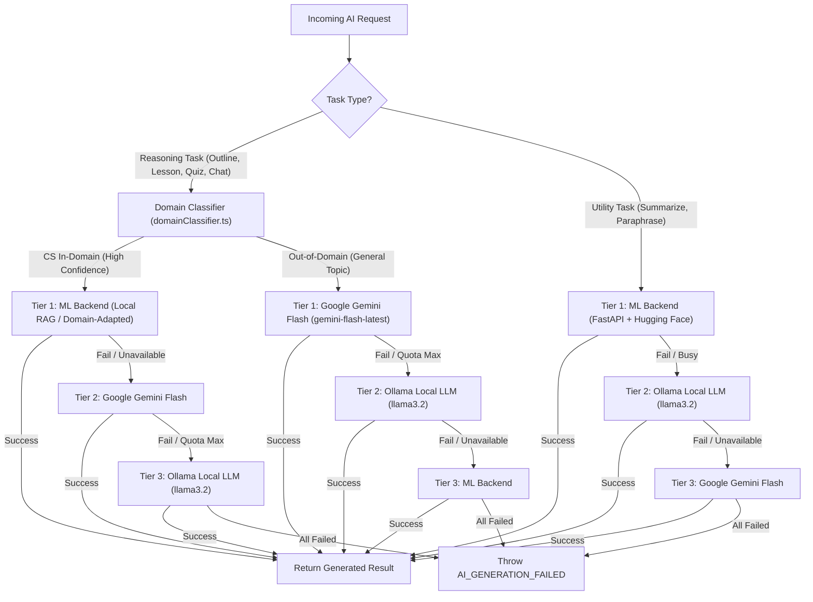
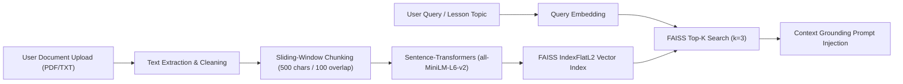

# Multi-Provider AI & RAG Architecture Specification

This document details the architectural design, provider selection logic, Retrieval-Augmented Generation (RAG) pipeline, and safety guardrails in the AI Study Buddy platform.

---

## 🔀 Multi-Provider Decision Tree

The system uses a high-availability, multi-tiered AI architecture supporting **Google Gemini API**, **Local Ollama LLMs**, and a **Self-Hosted Python FastAPI ML Microservice (`ml_backend`)**.

### Task Classification & Provider Routing Logic

Tasks are categorized into **Reasoning Tasks** (Course Outlines, Lesson Content, Quiz Generation, Contextual Chat) and **Utility Tasks** (Text Summarization, Text Paraphrasing).

> [!NOTE]
> **Domain Classification Mechanism & Confidence Score:**
> The domain classifier (`domainClassifier.ts`) uses a deterministic **token-Jaccard lexical overlap heuristic** against a curated 10-topic Computer Science syllabus taxonomy.
>
> - **Zero-Latency Routing**: Operates synchronously in TypeScript without incurring external API or ML inference overhead prior to task dispatch.
> - **Lexical vs. Semantic Confidence**: The output score ($0.0 - 1.0$) measures lexical token overlap against taxonomy topic tokens, not semantic model probability. Complex or non-literal phrasings of CS concepts may yield lower lexical scores and route to Google Gemini by default.
> - **Production Roadmap**: Future iterations can augment or replace this heuristic with a lightweight semantic bi-encoder (e.g. `Sentence-Transformers` cosine similarity or ONNX zero-shot classifier) in `ml_backend`.



### Provider Metrics & Health Tracking (`providerStats.ts`)

- **Usage Recording**: Every successful AI response increments counters for the active provider (`gemini`, `ollama`, `ml_backend`) in Firestore (`/system/providerStats`).
- **Quota Safety Margins**: Gemini API usage is tracked against daily rate limits (`isGeminiQuotaAvailable()`). If daily quota limits approach threshold safety margins, the system automatically redirects incoming requests to Tier 2 providers.
- **Circuit-Breaker Readiness**: Health pings (`pingMLBackend()`, `pingOllama()`) run with 3,000ms timeouts to detect degraded microservices before attempting inference payloads.

---

## 📦 RAG Pipeline & Vector Store Specification

The Retrieval-Augmented Generation (RAG) microservice (`/app/knowledge`, `/api/documents`) allows users to upload custom study materials (PDFs, text files) to ground course generation and assistant responses.



### 1. Document Chunking Strategy

- Documents are split into overlapping character chunks (default: 500 characters per chunk with 100-character overlap).
- Metadata is attached to every chunk: `{ documentId, userId, chunkIndex, startChar, endChar }`.

### 2. Embedding Model

- Embeddings are generated using **`sentence-transformers/all-MiniLM-L6-v2`** producing 384-dimensional dense floating-point vector representations.
- Inference is executed on CPU/GPU via PyTorch inside the `ml_backend` service.

### 3. FAISS Vector Search & Retrieval

- Indexed into an L2-distance FAISS vector index (`FAISS IndexFlatL2`).
- On query execution, top-$k$ ($k=3$) most semantically similar chunks are extracted and injected into the AI system prompt:
  ```
  Context from uploaded reference materials:
  ---
  [Chunk 1 Text]
  [Chunk 2 Text]
  ---
  Answer the user prompt strictly using the provided context when applicable.
  ```

### 4. Re-Ingestion & Stale Vector Cleanup

- When a user deletes or updates a document in `/app/knowledge`:
  1. The API removes document records from Firestore.
  2. The vector store purges all chunk embeddings tagged with the target `documentId` from the FAISS index.
  3. The index is re-built to prevent stale or orphaned vectors from contaminating search results.

---

## 🛡️ Guardrails: Memorization Guard & Content Moderation

### 1. Memorization Guard (`memorizationGuard.ts`)

- **Purpose**: Prevents AI models from regurgitating raw ingested training text verbatim or producing hallucinated content ungrounded in study material.
- **Mechanism**: Computes n-gram overlap and Levenshtein similarity distance between retrieved RAG context chunks and the model's generated output. If exact sequence matches exceed safety thresholds (e.g. $>85\%$ verbatim copy), the output is flagged for re-paraphrasing to ensure original instructional explanations.

### 2. Content Moderation Pipeline (`moderation.ts`, `ContentFlagModal.svelte`)

- **Pre-Ingestion Scanning**: User-submitted documents uploaded via `/api/documents` are scanned for prompt injection attacks and malicious scripts before vector embedding.
- **Post-Generation Scanning**: All AI-generated lesson content and quiz prompts pass through `moderation.ts` checking for inappropriate content or harmful material.
- **User Flagging**: Students can flag objectionable AI output using `ContentFlagModal.svelte`. Reports are routed directly to `/api/flag` and stored in Firestore for superadmin review in `/superadmin`.
