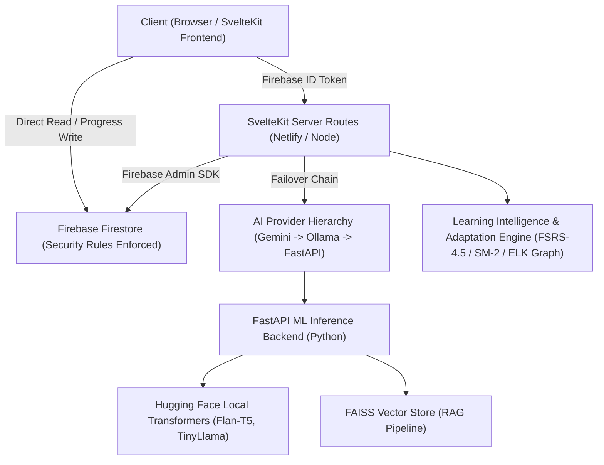

# Codebase Audit & Production Readiness Report

**Project**: AI Study Buddy  
**Document Classification**: Architectural Inspection, Code-Level Hardening & Verification Protocol  
**Last Updated**: 2026-09-01

> [!IMPORTANT]
> **Verification Boundary & Scope Disclaimer:**
>
> - **Syntax & Bytecode Validity (Verified):** The Python codebase passes bytecode compilation (`python3 -m compileall -q ml_backend` → 0 syntax errors). TypeScript / Svelte code has been verified through structural code inspection.
> - **Source Architecture & Design Patterns (Verified):** Architectural specifications, rate limiting, security rules, adaptive learning logic (FSRS-4.5, SM-2, recommendation heuristics), and fallback cascades exist in source code.
> - **Dynamic Runtime & Test Suite Execution (Requires Active Environment):** Dynamic verification (e.g., `npm run check`, `npm run build`, `npm run test:unit`, `pytest`, and Playwright E2E suites) requires a fully installed runtime environment with active network/node dependencies (`npm install`, Python virtualenv dependencies) and running services (Firebase Emulators / ML backend). In unbuilt archives or execution environments where dependency installation is not performed or times out, test passes and production runtime validity must be confirmed by executing the test commands listed in Section 4.

---

## 1. System Architecture Overview



---

## 2. Systematic Codebase Review & Module Status

### 🟢 SvelteKit Frontend & UI Components

- **Framework**: SvelteKit 2 with Svelte 5 Runes (`$state`, `$derived`, `$props`, `$effect`).
- **Styling**: Tailwind CSS v4 with custom tokens, dynamic dark mode parity, custom typography, and CSS micro-animations in [`src/routes/layout.css`](../src/routes/layout.css).
- **Core Components** ([`src/lib/components/`](../src/lib/components/)):
  - [`AppShell.svelte`](../src/lib/components/AppShell.svelte): Navigation layout, active route highlighting, and profile dropdown menu.
  - [`DraftOutlineEditor.svelte`](../src/lib/components/DraftOutlineEditor.svelte): Human-in-the-loop course drag-and-drop module reordering and outline editing.
  - [`AssistantChat.svelte`](../src/lib/components/AssistantChat.svelte): Floating AI study assistant drawer with course contextual prompts and RAG source citations.
  - [`KnowledgeMap.svelte`](../src/lib/components/KnowledgeMap.svelte): Interactive concept graph visualization powered by ELK.js layout engine with 'Explain My Progress' diagnostics.
  - [`MistakeNotebook.svelte`](../src/lib/components/MistakeNotebook.svelte): Automated error bank capturing question snapshots and misconceptions on missed quiz questions.
  - [`StreakHeatmap.svelte`](../src/lib/components/StreakHeatmap.svelte) & [`DailyGoalRing.svelte`](../src/lib/components/DailyGoalRing.svelte): User gamification and study consistency tracking.
  - [`CourseCard.svelte`](../src/lib/components/CourseCard.svelte), [`BadgeStrip.svelte`](../src/lib/components/BadgeStrip.svelte), [`ShareModal.svelte`](../src/lib/components/ShareModal.svelte), [`Toast.svelte`](../src/lib/components/Toast.svelte).

### 🟢 Backend API Routes & Security

- **Auth & Session Management**: Server-side verification of Firebase ID tokens in [`src/lib/server/auth.ts`](../src/lib/server/auth.ts). Automatic creation of user profiles with timezone awareness.
- **Admin SDK**: Singleton initialization in [`src/lib/server/admin.ts`](../src/lib/server/admin.ts) supporting local Firestore emulator and production service accounts.
- **Security Rules**: Database authorization rules defined in [`firestore.rules`](../firestore.rules), enforcing owner-only reads/writes and restricting client profile mutations.
- **API Endpoints**:
  - `POST /api/courses` — Atomic transactional rate-limiting & course outline generation.
  - `POST /api/courses/[id]/draft` — Outline customization before generation.
  - `POST /api/courses/[id]/fork` — Clone/fork an existing ready course into the authenticated user's library (wired to CourseCard "Duplicate" menu item).
  - `POST /api/modules/[id]/generate` — Module lesson/quiz content generation with generation queue handling.
  - `POST /api/modules/[id]/complete` — Updates progress and user study streaks.
  - `POST /api/spaced-repetition` — Card review submission and FSRS / SM-2 scheduling computation.
  - `POST /api/documents` — RAG document upload, chunking, and FAISS indexing.
  - `POST /api/courses/peer-questions` — Peer-authored quiz question submission with automated moderation (wired to QuizRunner post-quiz suggestion form).
  - `GET /api/courses/peer-questions?courseId=…` — Fetch approved community questions per course (wired to QuizRunner post-quiz community panel).
  - `POST /api/chat`, `POST /api/summarize`, `POST /api/paraphrase`, `GET /api/share/[token]`.

### 🟢 Learning Intelligence & Adaptive Engine

- **Adaptive Next-Action Engine**: [`src/lib/server/knowledgeMap/recommendNext.ts`](../src/lib/server/knowledgeMap/recommendNext.ts) evaluating FSRS memory retention, weak area thresholds, and prerequisite readiness.
- **Heuristic Mastery Scoring**: [`src/lib/server/knowledgeMap/masteryCalculator.ts`](../src/lib/server/knowledgeMap/masteryCalculator.ts) combining quiz accuracy (45%), memory retention (35%), recency (15%), and lesson completion (5%).
- **Spaced Repetition Schedulers**: Free Spaced Repetition Scheduler FSRS-4.5 ([`src/lib/server/fsrs.ts`](../src/lib/server/fsrs.ts)) and SuperMemo 2 ([`src/lib/server/sm2.ts`](../src/lib/server/sm2.ts)).
- **Safety & Guardrails**: Domain classifier ([`domainClassifier.ts`](../src/lib/server/ai/domainClassifier.ts)), memorization guard ([`memorizationGuard.ts`](../src/lib/server/ai/memorizationGuard.ts)), and content moderation pipeline ([`moderation.ts`](../src/lib/server/ai/moderation.ts)).

### 🟢 Python ML Backend (`ml_backend/`)

- **FastAPI Service**: Entrypoint in [`ml_backend/main.py`](../ml_backend/main.py) with endpoints for `/healthcheck`, `/outline`, `/lesson`, `/quiz`, `/summarize`, `/paraphrase`, `/chat`, `/documents`.
- **Model Warmup**: Non-blocking background task (`_async_warmup_models`) on startup to ensure instant HTTP boot times without server blocking.
- **Security**: Strict API Key validation (`X-API-Key`) and CORS check preventing `*` wildcards in production (`APP_ENV=production`).
- **Syntax Check Status**: Bytecode compilation verified via `python3 -m compileall -q ml_backend`.

### 🧪 Automated Test Suite Specifications & Verification Protocol

The repository includes a comprehensive automated test suite designed to validate core functionality across layers when dependencies are provisioned:

- **Static Analysis**: Configured via `npm run check` (`svelte-check`) targeting 0 errors across Svelte and TypeScript files.
- **Unit & Integration Test Suite**: 28 test files containing unit and integration assertions (including [`auth.test.ts`](../src/lib/server/auth.test.ts), [`courses.test.ts`](../src/routes/api/courses/courses.test.ts), [`microservices.test.ts`](../src/routes/api/microservices.test.ts), [`rules.test.ts`](../src/lib/firebase/rules.test.ts), [`recommendNext.test.ts`](../src/lib/server/knowledgeMap/recommendNext.test.ts), [`masteryCalculator.test.ts`](../src/lib/server/knowledgeMap/masteryCalculator.test.ts), [`fsrs.test.ts`](../src/lib/server/fsrs.test.ts), [`sm2.test.ts`](../src/lib/server/sm2.test.ts), [`provider.test.ts`](../src/lib/server/ai/provider.test.ts), etc.). Run via `npm run test:unit -- --run`.
- **Full Pipeline Integration Suite**: End-to-end server API lifecycle tests in [`pipeline.integration.test.ts`](../src/routes/api/pipeline.integration.test.ts) verifying unmocked Zod validation, moderation safety gates, Firestore course drafting, module generation, and streak calculations. Run via `npm run test:pipeline`.
- **Python ML Backend Tests**: Pytest suite in `ml_backend/` testing endpoints, schemas, and fallback logic. Run via `pytest ml_backend/`.
- **End-to-End Tests**: Dual Playwright suite configured in [`playwright.config.ts`](../playwright.config.ts):
  - **Hermetic Full Pipeline Gate** ([`tests/fullPipeline.hermetic.e2e.ts`](../tests/fullPipeline.hermetic.e2e.ts)): Validates live Firebase Auth emulator session, course creation wizard, Firestore database persistence, and module quiz flow without browser `page.route` network interception. Run via `npm run test:e2e:hermetic`.
  - **Fast UI & Layout Suite** ([`tests/userJourney.e2e.ts`](../tests/userJourney.e2e.ts) & [`tests/responsiveLayout.e2e.ts`](../tests/responsiveLayout.e2e.ts)): Validates UI component interactions and multi-viewport responsiveness across 8 resolutions. Run via `npm run test:e2e:ui`.

---

## 3. Implemented Hardening & Infrastructure Architecture

### 🛡️ Code-Level Hardening Implementations

1. **RAG Vector Store Disk Persistence**
   - **Implementation**: `rag_pipeline.py` implements disk serialization for FAISS index binary (`index.faiss`) and JSON chunk metadata (`docs.json`) via `_save_index` / `_load_index` to allow document embeddings to survive container restarts.

2. **Distributed Rate Limiting & Caching Architecture**
   - **Implementation**: `rateLimiter.ts` and `outlineCache.ts` are coded to interface with the Upstash Redis REST API in serverless environments, with atomic Firestore transactions and in-memory sliding-window fallback mechanisms.

3. **Multi-Provider AI Fallback Hierarchy**
   - **Implementation**: `provider.ts` implements cascading fallback logic: Tier 1 (Google Gemini) $\rightarrow$ Tier 2 (Local Ollama LLM) $\rightarrow$ Tier 3 (Self-Hosted Python FastAPI ML Backend).

4. **CI/CD Pipeline Configuration**
   - **Implementation**: `.github/workflows/ci.yml` defines automated CI steps for `npm run check`, `npm run lint`, Vitest unit tests, `npm audit`, and ML backend Pytest execution on push.

---

### 🔴 Host & Infrastructure Deployment Requirements

1. **Serverless Gateway Timeout Mitigation**
   - Heavy CPU inference (Flan-T5-large / TinyLlama) can take 15–40s on CPU. SvelteKit uses `generationQueue.ts` to background-process modules, decoupling client rendering from serverless function limits.

2. **Hardware Provisioning for ML Backend**
   - Hugging Face models (`google/flan-t5-large` and `TinyLlama-1.1B-Chat`) require **4 GB+ RAM**. Deploy `ml_backend` via `ml_backend/Dockerfile` to Docker-capable hosts (Cloud Run, Render 4GB+, AWS EC2).

---

### 🟡 High-Priority Recommendations for Live Deployment

1. **Production Environment Secrets & Config**
   Ensure all production environment variables are configured in Netlify / Render:
   - `PUBLIC_FIREBASE_API_KEY`, `PUBLIC_FIREBASE_AUTH_DOMAIN`, `PUBLIC_FIREBASE_PROJECT_ID`, `PUBLIC_FIREBASE_STORAGE_BUCKET`, `PUBLIC_FIREBASE_APP_ID`
   - `PUBLIC_FIREBASE_USE_EMULATOR=false`
   - `FIREBASE_SERVICE_ACCOUNT` (JSON string of the production Firebase service account key)
   - `ML_BACKEND_URL` (URL of deployed Python ML server)
   - `ML_BACKEND_API_KEY` (Strong random secret string, e.g. generated via `openssl rand -hex 32`)
   - `ALLOWED_ORIGINS=https://your-domain.netlify.app`
   - `APP_ENV=production`

2. **Firebase Auth Domain Whitelisting**
   - Add your production frontend domain (e.g., `https://your-app.netlify.app`) to **Firebase Console -> Authentication -> Settings -> Authorized Domains**, otherwise Google OAuth login will fail in production.

3. **Error Monitoring & Logging**
   - Integrate Sentry or LogRocket into the SvelteKit frontend and FastAPI backend for tracking unhandled errors and model generation failures in production.

---

## 4. Production Deployment & Live Verification Checklist

```markdown
- [ ] 1. Install dependencies (`npm install` and `pip install -r ml_backend/requirements.txt`).
- [ ] 2. Run static analysis verification (`npm run check`).
- [ ] 3. Run automated frontend test suite (`npm run test:unit -- --run`).
- [ ] 4. Run Python backend test suite (`pytest ml_backend/`).
- [ ] 5. Build production frontend bundle (`npm run build`).
- [ ] 6. Provision Python ML backend container with minimum 4GB RAM.
- [ ] 7. Generate shared `ML_BACKEND_API_KEY` secret.
- [ ] 8. Deploy `ml_backend` container to host (Render / Cloud Run / EC2).
- [ ] 9. Set up Netlify / Vercel project connected to your git repository.
- [ ] 10. Populate production environment variables in Netlify dashboard.
- [ ] 11. Add production domain to Firebase Console Authorized Domains.
- [ ] 12. Verify live OAuth login, course creation, and lesson generation flow.
```
