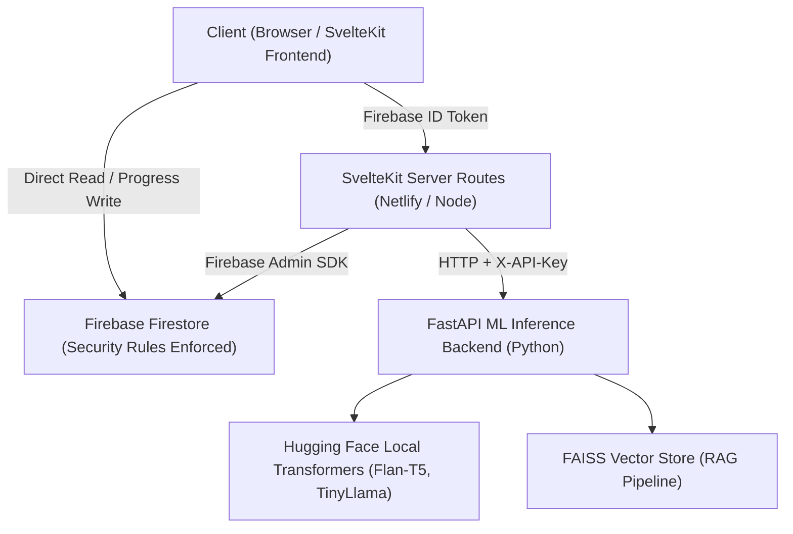

# Codebase Audit & Production Readiness Report

**Project**: AI Study Buddy  
**Date**: July 22, 2026  
**Status**: Development Complete / Production Audit Phase

---

## 1. System Architecture Overview



---

## 2. Systematic Codebase Review & Module Status

### 🟢 SvelteKit Frontend & UI Components

- **Framework**: SvelteKit 2 with Svelte 5 Runes (`$state`, `$derived`, `$effect`).
- **Styling**: Tailwind CSS v4 with custom tokens, dynamic dark mode parity, custom typography, and CSS micro-animations in [`src/routes/layout.css`](file:///c:/Users/OSCARPACK/Downloads/Study/src/routes/layout.css).
- **Core Components** ([`src/lib/components/`](file:///c:/Users/OSCARPACK/Downloads/Study/src/lib/components)):
  - [AppShell.svelte](file:///c:/Users/OSCARPACK/Downloads/Study/src/lib/components/AppShell.svelte): Navigation layout, active route highlighting, and profile dropdown menu.
  - [DraftOutlineEditor.svelte](file:///c:/Users/OSCARPACK/Downloads/Study/src/lib/components/DraftOutlineEditor.svelte): Human-in-the-loop course drag-and-drop module reordering and outline editing.
  - [AssistantChat.svelte](file:///c:/Users/OSCARPACK/Downloads/Study/src/lib/components/AssistantChat.svelte): Floating AI study assistant drawer with course contextual prompts.
  - [StreakHeatmap.svelte](file:///c:/Users/OSCARPACK/Downloads/Study/src/lib/components/StreakHeatmap.svelte) & [DailyGoalRing.svelte](file:///c:/Users/OSCARPACK/Downloads/Study/src/lib/components/DailyGoalRing.svelte): User gamification and study consistency tracking.
  - [CourseCard.svelte](file:///c:/Users/OSCARPACK/Downloads/Study/src/lib/components/CourseCard.svelte), [BadgeStrip.svelte](file:///c:/Users/OSCARPACK/Downloads/Study/src/lib/components/BadgeStrip.svelte), [ShareModal.svelte](file:///c:/Users/OSCARPACK/Downloads/Study/src/lib/components/ShareModal.svelte), [Toast.svelte](file:///c:/Users/OSCARPACK/Downloads/Study/src/lib/components/Toast.svelte).

### 🟢 Backend API Routes & Security

- **Auth & Session Management**: Server-side verification of Firebase ID tokens in [`src/lib/server/auth.ts`](file:///c:/Users/OSCARPACK/Downloads/Study/src/lib/server/auth.ts#L23-L72). Automatic creation of user profiles with timezone awareness.
- **Admin SDK**: Singleton initialization in [`src/lib/server/admin.ts`](file:///c:/Users/OSCARPACK/Downloads/Study/src/lib/server/admin.ts) supporting local Firestore emulator and production service accounts.
- **Security Rules**: Database authorization rules defined in [`firestore.rules`](file:///c:/Users/OSCARPACK/Downloads/Study/firestore.rules), enforcing owner-only reads/writes and restricting client profile mutations.
- **API Endpoints**:
  - `POST /api/courses` — Atomic transactional rate-limiting & course outline generation.
  - `POST /api/courses/[id]/draft` — Outline customization before generation.
  - `POST /api/modules/[id]/generate` — Module lesson/quiz content generation.
  - `POST /api/modules/[id]/complete` — Updates progress and user study streaks.
  - `POST /api/chat`, `POST /api/summarize`, `POST /api/paraphrase`, `GET /api/share/[token]`.

### 🟢 Python ML Backend (`ml_backend/`)

- **FastAPI Service**: Entrypoint in [`ml_backend/main.py`](file:///c:/Users/OSCARPACK/Downloads/Study/ml_backend/main.py) with endpoints for `/healthcheck`, `/outline`, `/lesson`, `/quiz`, `/summarize`, `/paraphrase`, `/chat`, `/documents`.
- **Model Warmup**: Non-blocking background task (`_async_warmup_models`) on startup to ensure instant HTTP boot times without server blocking.
- **Security**: Strict API Key validation (`X-API-Key`) and CORS check preventing `*` wildcards in production (`APP_ENV=production`).

### 🧪 Automated Test Suite & Code Quality

- **Static Analysis**: `npm run check` (`svelte-check`) passes with **0 errors**.
- **Unit & Integration Tests**: Vitest test suite running 42 tests across 8 test files ([`auth.test.ts`](file:///c:/Users/OSCARPACK/Downloads/Study/src/lib/server/auth.test.ts), [`courses.test.ts`](file:///c:/Users/OSCARPACK/Downloads/Study/src/routes/api/courses/courses.test.ts), [`microservices.test.ts`](file:///c:/Users/OSCARPACK/Downloads/Study/src/routes/api/microservices.test.ts), [`rules.test.ts`](file:///c:/Users/OSCARPACK/Downloads/Study/src/lib/firebase/rules.test.ts), etc.) — **100% passing**.
- **End-to-End Tests**: Playwright integration configured in [`playwright.config.ts`](file:///c:/Users/OSCARPACK/Downloads/Study/playwright.config.ts) and [`tests/userJourney.e2e.ts`](file:///c:/Users/OSCARPACK/Downloads/Study/tests/userJourney.e2e.ts).

---

## 3. Production Readiness Status & Implemented Hardening

### ✅ Resolved Infrastructure Items

1. **RAG Vector Store Persistence (RESOLVED)**
   - **Status**: `rag_pipeline.py` persists FAISS index binary (`index.faiss`) and JSON chunk metadata (`docs.json`) to disk (`_save_index` / `_load_index`). Document embeddings survive container restarts cleanly.

2. **Distributed Rate Limiting (RESOLVED)**
   - **Status**: `rateLimiter.ts` integrates Upstash Redis REST API for serverless environments with atomic Firestore transactions as secondary fallback.

3. **CI/CD Quality Pipeline (RESOLVED)**
   - **Status**: `.github/workflows/ci.yml` is active and executes `npm run check`, `npm run lint`, Vitest unit tests, `npm audit`, and ML backend Pytest jobs on every push.

---

### 🔴 Host & Infrastructure Deployment Requirements

1. **Serverless Gateway Timeout Mitigation**
   - Heavy CPU inference (Flan-T5-large / TinyLlama) can take 15–40s on CPU. SvelteKit uses `generationQueue.ts` to background-process modules, decoupling client rendering from serverless function limits.

2. **Hardware Provisioning for ML Backend**
   - Hugging Face models (`google/flan-t5-large` and `TinyLlama-1.1B-Chat`) require **4 GB+ RAM**. Deploy `ml_backend` via `ml_backend/Dockerfile` to Docker-capable hosts (Cloud Run, Render 4GB+, AWS EC2).

---

### 🟡 High-Priority Recommendations

1. **Production Environment Secrets & Config**
   Ensure all production environment variables are configured in Netlify / Render:
   - `PUBLIC_FIREBASE_API_KEY`, `PUBLIC_FIREBASE_AUTH_DOMAIN`, `PUBLIC_FIREBASE_PROJECT_ID`, `PUBLIC_FIREBASE_STORAGE_BUCKET`, `PUBLIC_FIREBASE_APP_ID`
   - `PUBLIC_FIREBASE_USE_EMULATOR=false`
   - `FIREBASE_SERVICE_ACCOUNT` (JSON string of the production Firebase service account key)
   - `ML_BACKEND_URL` (URL of deployed Python ML server)
   - `ML_BACKEND_API_KEY` (Strong random secret string, e.g. generated via `openssl rand -hex 32`)
   - `ALLOWED_ORIGINS=https://your-domain.netlify.app`
   - `APP_ENV=production`

2. **Firebase Auth Domain Whitelisting**
   - Add your production frontend domain (e.g., `https://your-app.netlify.app`) to **Firebase Console -> Authentication -> Settings -> Authorized Domains**, otherwise Google OAuth login will fail in production.

3. **Fix Accessibility (A11y) Warning**
   - In [`src/lib/components/DraftOutlineEditor.svelte:111`](file:///c:/Users/OSCARPACK/Downloads/Study/src/lib/components/DraftOutlineEditor.svelte#L111), add `role="listitem"` or appropriate ARIA roles to the draggable module element to satisfy screen-reader compliance.

4. **Error Monitoring & Logging**
   - Integrate Sentry or LogRocket into the SvelteKit frontend and FastAPI backend for tracking unhandled errors and model generation failures in production.

---

### 🔵 Maintenance & CI/CD Pipeline

1. **Automated GitHub Actions Workflow**
   - Add `.github/workflows/ci.yml` to automatically run `npm run check`, `npm run lint`, and `npm run test:unit` on every pull request.

---

## 4. Production Deployment Checklist

```markdown
- [ ] 1. Build and test production frontend bundle (`npm run build`).
- [ ] 2. Provision Python ML backend container with minimum 4GB RAM.
- [ ] 3. Generate shared `ML_BACKEND_API_KEY` secret.
- [ ] 4. Deploy `ml_backend` container to host (Render / Cloud Run / EC2).
- [ ] 5. Set up Netlify / Vercel project connected to your git repository.
- [ ] 6. Populate production environment variables in Netlify dashboard.
- [ ] 7. Add production domain to Firebase Console Authorized Domains.
- [ ] 8. Verify live OAuth login, course creation, and lesson generation flow.
```
